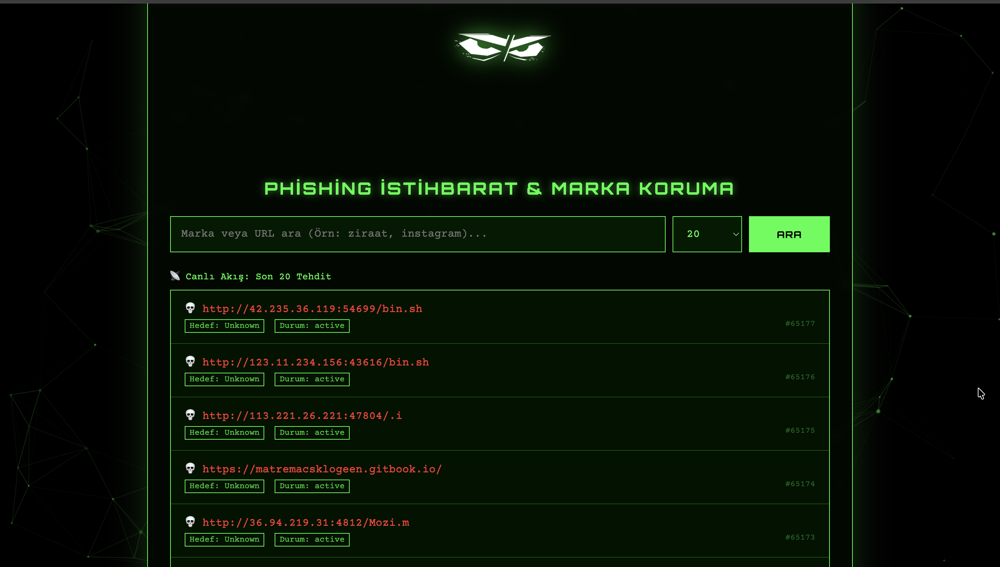
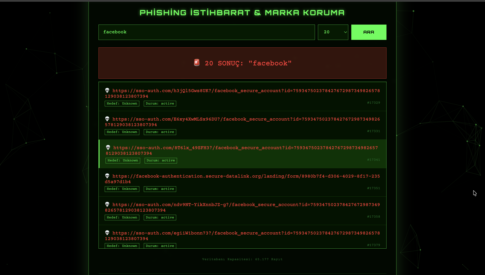

Markdown

# 🛡️ Phishing Radar & Brand Intelligence

<div align="center">

[](https://python.org)
[](https://fastapi.tiangolo.com)
[](https://www.sqlalchemy.org/)
[](LICENSE)

</div>

> **Marka Koruma, Tehdit İstihbaratı ve Oltalama (Phishing) Tespit Aracı**

Bu proje, şüpheli URL'leri analiz etmek, marka taklidi yapan dolandırıcı siteleri tespit etmek ve gerçek zamanlı tehdit akışı sağlamak için geliştirilmiş modern bir siber güvenlik aracıdır. **Matrix temalı** arayüzü ve yüksek performanslı **FastAPI** backend mimarisi ile siber güvenlik analistleri ve son kullanıcılar için hızlı bir çözüm sunar.

---

## 📸 Ekran Görüntüleri

| **Matrix Arayüzü & Canlı Akış** | **Arama Sonuçları & Marka Koruma** |
|:-------------------------:|:-------------------------:|
|  |  |

---

## ⚡ Özellikler

* 🕵️‍♂️ **Gelişmiş URL Tarama:** Veritabanındaki binlerce zararlı site kaydı arasında milisaniyeler içinde sorgulama yapar.
* 🛡️ **Marka Koruma (Brand Protection):** "Ziraat", "Instagram", "Netflix" gibi anahtar kelimelerle taklit siteleri (Typosquatting vb.) yakalar.
* 📡 **Canlı Tehdit Akışı:** Sisteme eklenen en son tehditleri (Latest Threats) anlık olarak listeler.
* 🎨 **Hacker / Matrix UI:** `Particles.js` ile güçlendirilmiş, duyarlı (responsive) ve modern karanlık mod arayüzü.
* 🚀 **Yüksek Performans:** Python **FastAPI** ve Asenkron (Async) yapı sayesinde çok hızlı yanıt süresi.
* 🔒 **Güvenlik Standartları:** Pre-commit hook'ları ile temiz kod ve güvenlik taramaları.

---

## 🛠️ Hızlı Kurulum ve Çalıştırma

Projeyi tek seferde kurup çalıştırmak için aşağıdaki komutları terminale yapıştırmanız yeterlidir:

```bash
# 1. Projeyi İndir
git clone https://github.com/tekdemirenes/PhisingDetector.git
cd PhisingDetector

# 2. Kurulumu Yap ve Çalıştır (Mac/Linux)
python3 -m venv .venv && source .venv/bin/activate
pip install -r requirements.txt
uvicorn app.main:app --reload
Not: Windows kullanıyorsanız sanal ortamı .venv\Scripts\activate komutuyla aktif edebilirsiniz.

Tarayıcınızda şu adrese gidin: 👉 http://127.0.0.1:8000

🏗️ Teknoloji Yığını (Tech Stack)
Backend: Python 3.10+, FastAPI, Pydantic

Veritabanı: SQLAlchemy (ORM), PostgreSQL / SQLite

Frontend: HTML5, CSS3 (Custom Matrix Theme), JavaScript

Araçlar: Uvicorn, Pre-commit Hooks, Git
